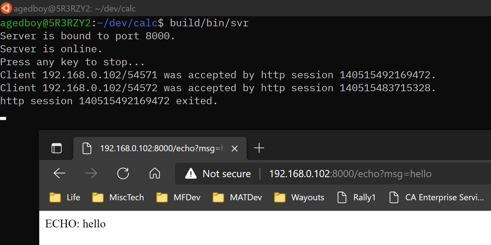

# CALC - 一个认真的玩具HTTP服务器，C/C++版

_您这是在干吗？_

_我这是一个中年程序员的荒诞主义实践。_

_荒……荒什么？_

---

## 我的故事

[谁要听你的鬼故事，请直奔主题吧](#main)

2021年圣诞节快到，我一个人下班回到家，坐在安静的屋子里，略感疲惫。我很想找点乐子，但是喝酒、游戏、右手，它们统统失去了吸引力。于是我想起应该学学Docker。我知道，十年前就该学的，但我一直犯懒。

看了几页新手教程，觉得我也得做自己的Docker image对吧？我该打包些什么进去呢？打包一个Hello World程序未免太无聊了。要不，用Spring boot写一个简单的网站后台？这个虽然更对得起Docker，但是写Spring boot应用这件事本身太无趣了，不是吗？

于是一个主意跳进我脑子里：用C++写一个HTTP服务器吧！看看我最远能走多远。与其写个基于HTTP服务器的web应用，不如写HTTP服务器本身。如果你读完了我的故事，说明你跟我一样无聊。那正好，一起来吧。

---

## <a id="main"> 已经实现了什么？</a>

- 一个TCP侦听服务器
- 一个HTTP协议的基础处理器，它可以:
  - 接收请求
  - 解析查询参数（就是问号后面的部分），以及HTTP头中参数（就是请求header中的部分）
  - 绑定API到请求路径（支持简单通配符、路径变量、正则匹配）
  - 发送响应
  - 用于支持multi-part/form-data的工具函数
  - 用于支持静态页面文件夹的现成web服务（反正只要有网站前端就总是会用到这个，所以写在基础处理器里了）
- 几个简单的web服务（REST API）
  - Echo: 从?msg=...接收消息并复制到响应中
  - Dump: 将接收到的查询参数、header，以及请求body统统打印出来（其实有一定的实用价值）
  - Ascii图生成网站: 接收图片，转换为Ascii图，并通过响应发回
    - 前端: 一个含有JavaScript的静态页面，让用户选择图片文件、发送、接收，并设置到页面中的pre文本框里
    - 后端: 一个API，接收图片文件并返回Ascii图
- 由于我在API绑定上下了一点功夫，所以理论上这个项目可以支持完整网站

---

## 一些截图

### ECHO服务


### DUMP服务


### Ascii图服务


感觉怎么样？有点意思了没？去从冰箱里拿瓶啤的出来，咱们继续。

---

## 编译生成该项目

你需要:

- Linux平台
- Git 2.13+
- g++ 并能够支持如下: (比如g++ 10)
  - C++17
  - std::filesystem
- CMake 3+
- jq (一个很小的Linux工具，编译生成时需要用一小下)
- 你的机器得能联网对吧

*(接下来我假设你是个高能C++程序员，因此不会从人是猴变的开始讲)*

编译生成步骤:

1. 安装`jq`。

Ubuntu:

```sh
sudo apt-get install jq
```

Manjaro:

```sh
sudo pacman -Syu jq
```

使用其他分发版本的，根据自己的系统来安装它。

请尝试运行下面命令以确认`jq`已经可用:

```sh
ip -j route get 8.8.8.8 | jq -r ".[0]|.prefsrc"
```

上面命令应该可以打印出你的机器中目前用于上网的网卡的IP地址。

2. 下载本项目（这一步生成的文件夹，在后文中称为“源文件夹”）。

```sh
git clone git@bitbucket.org:agedboy/calc.git --recurse-submodules

```

注意别遗漏`--recurse-submodules`选项。

3. 创建编译生成文件夹（这一步生成的文件夹，在后文中称为“建造文件夹”）

```sh
mkdir <建造文件夹>
```

4. `cd`进入建造文件夹，并开始编译生成。

```sh
cd <建造文件夹>
cmake <源文件夹>
cmake --build .
```

5. 添加一个环境变量`CALC_SITE_HOME`。建议将下面这句添加到你的`.bashrc`文件中.

```sh
export CALC_SITE_HOME=<建造文件夹>
```

6. 启动服务器。

```
cd <建造文件夹>
bin/svr

Server is bound to port 8000.
Server is online.
Press any key to stop...
```

如果默认端口8000已被占用，或者被屏蔽，可以用这样的命令行启动服务器："`bin/svr [其他可用的端口号]`"，比如: "`bin/svr 8008`"。

服务器启动好之后，可以用下面的URL访问示例服务：

ECHO：`http://<your ip>:8000/echo?msg=xxxx`

DUMP：`http://<your ip>:8000/dump`

ASCII图：`http://<your ip>:8000/asca[?requested-width=<a pixel width>]`

ASCII图服务要求通过`multi-part/formdata`来发送图片文件的原始数据（不用预先解码）。form中必须有至少一项，其头部的`Content-Disposition`为`asca-source-image`，然后其内容为图片文件的原始数据。可支持`JPG`、`PNG`、`GIF`、`TIFF`、`BMP`和`HDR`格式。

可以用下面的`curl`命令来简单测试ASCII图服务，以便万一前端在你的机器不能用：

```sh
curl -F "asca-source-image=@<a picture file>" "http://<你机器的IP地址>:8000/asca" --output -
```

一切顺利的话，上面的命令应该输出下面文本内容：

```
agedboy@5R3RZY2:~$ curl -F "asca-source-image=@chicken.png" "http://192.168.0.102:8000/asca?re
quested-width=40" --output -
                     .o#########+.
                     .o#########+.
                     .############.
                     .###o.ooo####+.
                     .###o.   .+###.
                     .###+oo+oo+###.
                     .+#####+++####.
                     .####+o++.+###o..
                     o####.####.####+o..
                     o###+o## #+####+o..
                     o###o.####.####+o..
                     +###o.+###+####+o..
                    .+###o .ooo####o..
                    .####.    o###+
                   .+####.    o###+
                  .+####o     o####.
               ..o######.     .####.
...oooooooooo++########o      .####o
..+###################o        o###+
..+#################+.  ...    o####.
..+###############o..  .ooo.   .####.
..+####+oooooooo..     .+oo.   .####.
oo#####o               o+.+o    +###o
oo####+.               o+.+o    +###o
..####+.              .++.+.    +###o
..+####o              .+oo+.    +###o
..+####o              o+.++.   .####o
..#####+.            .++.+o    o####.
..+######o.         .o+.++.   .####+
  .+#######o..     .o+oo+o  .o#####.
   .o########+o..oo++o.+o..o######o
     .o#############+.oo+########+.
       .+#######################o.
         .o###################+.
           ..o+############+o.
              .o+ ++o++.+o..
             .o#+o++.o+o+#+o.
            .o+o..o+oo+o..o+o.
            .oo.oo.o.oo.o..oo.
            .oo.oo.o.oo.o..oo.
agedboy@5R3RZY2:~$
```

---

## 理解设计思路和代码实现

如果看到这里，你还打算继续跟我玩，请先收下我的膝盖！！

好了，下面我非常简要的做一些指引，以便帮你快速在代码中找到方向。而作为高能C++程序员的你，理解具体实现自然不用我多啰嗦。别担心，毕竟这是一个非常小的项目。

### 模块

|模块名称  |作用                                      |
|--------|-------------------------------------------------|
|com     |TCP和HTTP基础服务器实现|
|svr     |具有3个示例API的web应用服务器，程序入口也在这里|
|[fmt](https://github.com/fmtlib/fmt)|(submodule) 一个C++ format模板库|
|[keypress](https://github.com/MichaelDipperstein/keypress)|(submodule) 用于实现"press any key to continue..."|
|[picojson](https://github.com/kazuho/picojson)|(submodule) 一个C++ JSON读写库|
|[stb](https://github.com/nothings/stb)|(submodule) 著名的图片文件格式读写库|

**本人对上面四个开源库的作者以及参与者致以由衷的敬意。**


### 源文件

推荐按照下面的顺序阅读源文件。

*(这里可能会补充更多解释……)*

---

**com/tcpsvr.cpp**

从这里开始，可以较容易地读懂这个项目。

这个文件里实现简单的TCP侦听服务器。在类的构造函数中创建了socket的fd，并且绑定了指定的端口。在类的`online`成员函数中，启动了侦听线程。每当收到客户端的链接请求时，接受请求、建立TCP连接，然后将连接的fd，和预先设置的应用协议处理器lambda，放在一起形成lambda，交给线程池去运行。（如果看不懂我在说什么，是因为这段不好用文字去描述，你去看一眼代码就一目了然了，就一行代码的事。）

---

**com/httpsvr.cpp**

这个文件实现了基础的HTPP应用层协议。这里面没有使用面向对象范式，因为没必要，所以只有一大把函数而已。其中`handler()`函数是主要入口，你可以先找到它，并从那里看起。你可以清晰地看到“接受请求-处理请求-发送响应”的整个脉络。

请留意一下`find_controller()`函数，因为它是带你进入下一个重要模块的传送门。

---

**com/httpapi.cpp**

嗯……这个模块可能略微费解。它实现的是API和URL路径绑定。请先找到`add()`函数，并阅读它的注释（很抱歉暂时没有中文版注释，后面有时间会补上）。那个注释大概解释了都支持那些绑定方式。如果还看不太明白，可以结合`svr/frontend.cpp`再看看，应该就明白了。如果你有Spring Framework的开发经验，可以联想一下Spring里面是怎么将controller的函数与请求路径进行绑定的，应该很快就明白了。

你看到`REGISTER_CONTROLLER`这个宏了吗？API函数就是用这个宏作用辅助工具来绑定请求路径的。除了静态路径之外，还支持简单通配符（一个星号）、正则表达式匹配，以及路径变量。是不是很Spring，嗯？现在你应该逐渐开始理解`add()`函数在`com/httpapi.cpp`在做什么了。

**重要提示**: `add()`函数在收到URL路径模板后，会将它从“/”字符处切断成为一个“节点”串。然后会将这些“节点”形成一个Trie树（哈，只是个非典型疑似Trie树啦）。这样做的好处显然是为将来接收到客户端的请求URL后，可以避免对子串进行重复匹配。

如果不明白，只需要闭上眼睛想一下，若是你，你怎么实现？假如你有N个API，它们绑定到不同的URL路径上。运行时，客户端不停地发来请求URL。然后你肯定要将请求URL，与这N个API所绑定的URL路径一一对比，对吧？这样当然可以。但如果这N个API所绑定的URL路径，很多路径的前面一部分相同，从中间某处开始不同，那么你如何避免重复匹配前面相同的部分子串捏？显然，用Trie树嘛，对吧。说白了，就像文件系统的文件夹结构，按理说文件系统也可以不支持文件夹，每个文件都具有一个长长的，长长的文件名，也能达到效果，就是检索的时候慢。

*（一个无用的冷知识：我工作在IBM z系列大型机上。那上面的MVS操作系统，其原生文件系统就没有文件夹，采用的就是我说的那个“长长的，长长的文件名”。）*

让我们最后再举个例子。假设要添加5个API，并绑定到如下路径：

1. GET  --- api/v1/users/profiles --- lambda_get_profile()
2. GET  --- api/v1/users/albums   --- lambda_get_album()
3. GET  --- api/v1                --- lambda_sysinfo_v1()
4. POST --- api/v1/users/profiles --- lambda_update_profile()
5. POST --- api/v1/products       --- lambda_update_product()

它生成的非典型疑似Trie树长这样：

```
                       [root]
                          |
                       [api]
                          |
          +---------------+-----------------+
          |                                 |
       [ GET ]                           [POST]
          |                                 |
       [ v1  ]----lambda_sysinfo_v1()    [ v1  ]
          |                                 |
          |                       +---------+---------+
          |                       |                   |
       [users]                 [users]                |
          |                       |                   |
    +-----+-----+                 |                   |
    |           |                 |                   |
[profiles]   [albums]-+       [profiles]           [product]-+
    |                 |           |                          |
lambda_get_profile()  |       lambda_update_profile()        |
                      |                                      |
             lambda_get_album()                    lambda_update_product()
```

明白了吧？很简单的东西，我其实不太好意思拿出来说。但还是很想跟你多唠两句。

**svr/echo.cpp**

---

前面介绍几个`com/`文件夹中的源代码文件。并没有介绍完所有的，但TCP和HTTP的基础实现差不多也就是那些。剩下的，若有兴趣你自己去慢慢看。

现在看看`svr/echo.cpp`这个文件，你应该先注意到`REGISTER_CONTROLLER`这个宏，然后知道这个API绑定在`GET http://<domain>/echo`和`POST http://<domain>/echo`这两个路径上。

然后观察一下这个API的入参，以及返回值。首先你会看到，HTTP基础模块会向每个API函数提供以下入参：

|参数|作用|
|-----------|--------------------------------|
|request    |字节buffer，里面装着请求body|
|args_url   |键-值映射表，里面装着路径变量|
|args_query |键-值映射表，里面装着查询参数|
|args_header|键-值映射表，里面装着请求header里的参数|

这些参数都是什么？

让我们暂时把ECHO放一边，想象一下，假如有一个客户端请求，希望更好用户年龄（`age`）：

```
POST http://<domain>/api/v1/users/zhou/profile?age=42

HEADER
-------------------
POST /api/v1/users/zhou/profile HTTP/1.1
Accept: */*
Content-Length: 0
Host: 192.168.0.102:8000
User-Agent: curl/7.68.0
```

然后我们有一个API函数绑定在如下路径：

`POST api/v1/users/{user}/profile`

那么当请求到来的时候，这个绑定的API函数便会从HTTP基础模块收到如下参数：

```
args_url: {
    "user": "zhou"
}

args_query: {
    "age": 42
}

args_header: {
"Accept": "*/*"
"Content-Length": "0"
"Host": "192.168.0.102:8000"
"User-Agent": "curl/7.68.0"
}
```

现在回到`svr/echo.cpp`文件里`lambda_echo()`函数，我想你应该已经明白它能够接收什么，以及能够返回什么了。不妨想象一下，如果你能写个自己的API函数，你可以利用从客户端接收到的`args_query`、`args_header`和`request`信息做些什么有趣的事？你对于web应用有什么有趣的想法吗？要不你也在`svr/`文件夹里模仿`echo.cpp`添一个文件，写一个自己的API，然后用浏览器或者`curl`试试看？

---

**svr/asca.cpp**

啊，这其实是这个项目最有趣的部分，但我不想多解释，因为它与“HTTP服务器”这件事无关，纯粹是为了弄个招牌，吸引眼球。当然，也是给自己解闷用的。反正就是先将图片变成灰度图，然后用卷积算法对图像进行降噪、提取边缘，再用简单的除法缩小图像的动态范围，最后查表将亮度转换为预先设定好的字符，就形成Ascii图了。至于效果嘛，能好到哪去呢？

```
[原图] -> [解码获得像素] -> [缩小] -> [降噪（高斯平滑）] -> [边缘提取（Sobel）] -> [降动态] -> [查表转换ascii字符]
```


## CALC... 等等，这项目为啥叫CALC？

CALC有什么深意吗？

有个毛深意，唉，一开始我是想做个API，实现代数运算式子的解析求值，所以叫“CALC”（即Calculator）。但是想了想，用算符优先法吧，太土；通过LEX/AST/COMPILE去实现吧，又太累，累了半天也就是个计算器程序。没劲。所以就改为去做Ascii图。但是当时文件夹“calc”已经创建了，基础部分已经写了一些了，就不想改了。

完活。再见。欢迎交流。邮箱：agedboy@gmail.com。

写于2021年11月21日。
