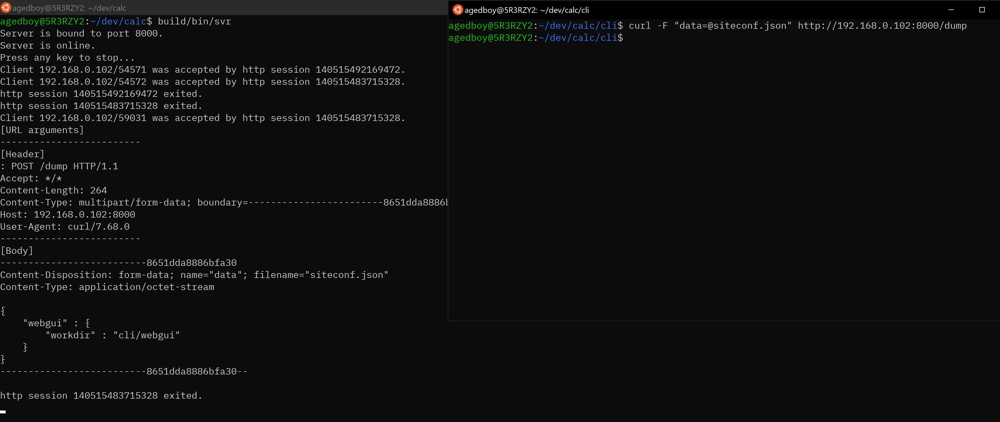
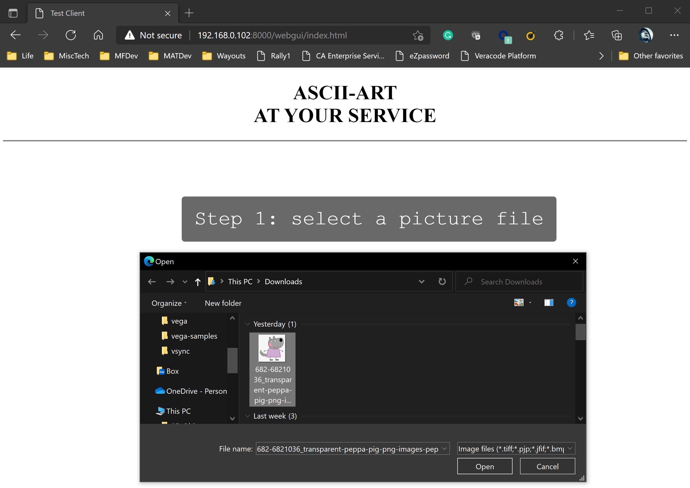
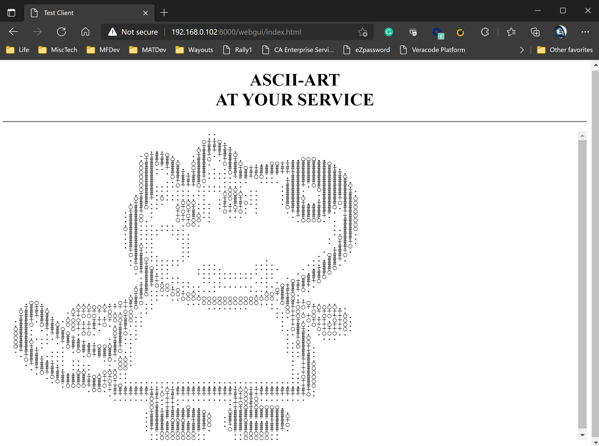

# CALC - A Toy Http Server For C/C++

_A middle-aged programmer's practice of absurdism._

_Abs... say what?_

---

## Why?

[I don't care why --->](#main)

I just wanted to practise creating my first Docker image at the very beginning. I wanted to pack something that is more interesting then the "busy box".

I thought about a hello-world REST backend with a Tomcat. Then I thought it must interesting to create a server without relying on the Tomcas and Spring-boot. Then I thought it must the challenging to create it using C or C++. Lastly, I totally forgot about the Docker thing, because the C++ http server project is sooooo interesting.

---

## <a id="main">What do we have?</a>

- A TCP listening server
- A Base HTTP protocol handler that:
  - Receives requests
  - Extracts query and header parameters
  - Binds user APIs to http method and path (supports path variables)
  - Sends responses
  - Utility to support multi-part/form-data
  - Utility to support static page directory
- HTTPS support
- Sample web services
  - Echo: accepts message from ?msg=... and echos it back
  - Dump: prints query/header parameters and request body to the console
  - Ascii-Art website: converts pictures to ascii-art text blocks
    - Frontend: a static page to send picture and receive/show ascii-art text
    - Backend: one API to receive pictures and produce ascii-art text
- It is easy to add more web services with the API-binding mechanism

---

## Screenshots

### The ECHO service


### The DUMP service


### The Ascii-Art service



What would you say? It starts to make some sense, doesn't it?

Do you have some beer or rum in your fridge? Go get some and let's move on.

---

## Build the project

You need:

- Linux platform
- Git 2.13+
- g++ that must supports: (i.e., g++ 10)
  - C++17
  - std::filesystem
- CMake 3+
- openssl-dev (for Debian-based systems)
- A working Internet/Intranet connection

*(I assume you are a mighty C/C++ programmer with good understanding of web applications. I know you are, otherwise you won't get here.)*

Build steps:

1. Install `libssl-dev`

Ubuntu:

```sh
sudo apt-get install libssl-dev
```

Manjaro: no need.

2. Clone the repository using Git (I will call it `"the source directory"`)

```sh
git clone git@bitbucket.org:agedboy/calc.git --recurse-submodules

```

Do not omit the `--recurse-submodules` option.

3. Create a directory for the build outs (I will call it `"the build directory"`)

```sh
mkdir <the build directory>
```

4. `cd` into `<the build directory>` and cmake it.

```sh
cd <the build directory>
cmake <the _source directory>
cmake --build .
```

5. Export an environment variable `CALC_SITE_HOME`. I recommand you put it in your `.bashrc` file.

```sh
export CALC_SITE_HOME=<the build directory>
```

6. Run the server.

```
cd <the build directory>
bin/svr

CALC http server at your service.
Starting HTTP server...
HTTP server is bound to port 1080.
HTTP server is online.
Loading certificate and private key...
Starting HTTPS server...
HTTPS server is bound to port 1443.
HTTPS server is online.
All servers are up online, press any key to stop...
```

If the default port 1080 is in use in your computer, run the server by: "`bin/svr -p [a-port-number]`". Such as: "`bin/svr --port 8000`". (run `bin/svr -h` for more command options.)

The URL of the three web services:

ECHO: `http://<your ip>:1080/echo?msg=xxxx`

DUMP: `http://<your ip>:1080/dump`

ASCII-ART: `http://<your ip>:1080/asca[?requested-width=<a pixel width>]`

*(To play with the ASCII-ART service, just visit the URL: `http://<your ip>:1080/` using your web browser.)*

The ASCII-ART requires the picture file to be sent with `multi-part/formdata`. The form must have at least one entry carrying the raw picture file data. The name in the `Content-Disposition` must be `asca-source-image`. It supports `JPG`, `PNG`, `GIF`, `TIFF`, `BMP`, and `HDR`.

The following `curl` command can easily test the ASCII-ART service:

```sh
agedboy@5R3RZY2:~$ curl -F "asca-source-image=@<a picture file>" "http://<your ip>:8000/asca" --output -
```

A sample output of my test:

```
agedboy@5R3RZY2:~$ curl -F "asca-source-image=@chicken.png" "http://192.168.0.102:8000/asca?re
quested-width=40" --output -
                     .o#########+.
                     .o#########+.
                     .############.
                     .###o.ooo####+.
                     .###o.   .+###.
                     .###+oo+oo+###.
                     .+#####+++####.
                     .####+o++.+###o..
                     o####.####.####+o..
                     o###+o## #+####+o..
                     o###o.####.####+o..
                     +###o.+###+####+o..
                    .+###o .ooo####o..
                    .####.    o###+
                   .+####.    o###+
                  .+####o     o####.
               ..o######.     .####.
...oooooooooo++########o      .####o
..+###################o        o###+
..+#################+.  ...    o####.
..+###############o..  .ooo.   .####.
..+####+oooooooo..     .+oo.   .####.
oo#####o               o+.+o    +###o
oo####+.               o+.+o    +###o
..####+.              .++.+.    +###o
..+####o              .+oo+.    +###o
..+####o              o+.++.   .####o
..#####+.            .++.+o    o####.
..+######o.         .o+.++.   .####+
  .+#######o..     .o+oo+o  .o#####.
   .o########+o..oo++o.+o..o######o
     .o#############+.oo+########+.
       .+#######################o.
         .o###################+.
           ..o+############+o.
              .o+ ++o++.+o..
             .o#+o++.o+o+#+o.
            .o+o..o+oo+o..o+o.
            .oo.oo.o.oo.o..oo.
            .oo.oo.o.oo.o..oo.
agedboy@5R3RZY2:~$
```

---

## Try HTTPS

When you pull and build this project, the server's private key and certificate created and signed by me will be automatically copied into the build directory. However, if you want to visit the HTTPS site, you must install my CA certificate in your computer as a root certificate, which means you must trust me.

If you are experienced with CA certificate, just find the file "ca.pem" in the "\<project>/ca" directory and install it, then you can visit the demo site using `https://<your ip>:1443/`.

If you would like to know some fundamental knowledge about SSL and the certificates, [please read this doc](./ca.en.md).

---

## Understanding the code and design

If you decide to stay with me and deep dive into the implementation, please accept my greatest appreciation !!

Wait a sec... have we met each other in that mental hospital? The one having a small fountain in the backyard. Remember it?

Alright, I will give you some very brief introduction to the code so that you could understand it more quickly. But, don't worry, it is a very small project.

### The modules

|Module  |Description                                      |
|--------|-------------------------------------------------|
|com     |The TCP and HTTP base servers and some utilities |
|svr     |The web service server with the 3 APIs           |
|[fmt](https://github.com/fmtlib/fmt)|(submodule) A C++ format template library|
|[keypress](https://github.com/MichaelDipperstein/keypress)|(submodule) For "press any key to continue..."|
|[picojson](https://github.com/kazuho/picojson)|(submodule) A C++ JSON read/write library|
|[clipp](https://github.com/muellan/clipp)|(submodule) A command line parser library|
|[stb](https://github.com/nothings/stb)|(submodule) The well-known picture format library|

**Special thanks to the five great github projects and their authors/contributors.**


### The files

I recommand you to read the source code files in the following order.

*(More explanations are coming soon...)*

---

**com/tcpsvr.cpp**

A good starting point for reading the code.

The TCP listening server is in it. It binds the listening port in the `ctor`, and starts the listening thread in the `online` function. Nothing special but some text-book-ish socket programming.

---

**com/httpsvr.cpp**

The HTTP protocol handling module. Non-OO paradigm, just a bunch of functions. The `handler()` is the main entrance and you should start from it. You will clearly see the whole receipt-process-response workflow for handling an HTTP request.

Pay attention to the `find_controller()` function. It is a "portal" that takes you to the next important module: httpapi.

---

**com/httpapi.cpp**

This module is a little bit hard to understand quickly. Please find the `add()` function and read its comment first. If the comment does not make good sense for you, take a look at the file `svr/frontend.cpp`. Do you see those `REGISTER_CONTROLLER` macros? That's how an API function/lambda is bound to a method/path. Besides static path, it also supports wildcards, regex, and path variables. Think about how you do it in Spring-boot programs. Now you should start to understand what the `add()` function in `com/httpapi.cpp` is doing.

**An important hint**: the `add()` function accepts URL path patterns, breaks them into nodes by '/', and put the nodes onto a trie-ish tree. The tree speeds up API finding in some extent.

Suppose we want to add 4 path patterns:

1. GET --- api/v1/users/profiles --- lambda_get_profile()
2. GET --- api/v1/users/albums --- lambda_get_album()
3. GET --- api/v1 --- lambda_sysinfo_v1()
4. POST --- api/v1/users/profiles --- lambda_update_profile()
5. POST --- api/v1/products --- lambda_update_product()

The trie-ish tree will be like:

```
                       [root]
                          |
                       [api]
                          |
          +---------------+-----------------+
          |                                 |
       [ GET ]                           [POST]
          |                                 |
       [ v1  ]----lambda_sysinfo_v1()    [ v1  ]
          |                                 |
          |                       +---------+---------+
          |                       |                   |
       [users]                 [users]                |
          |                       |                   |
    +-----+-----+                 |                   |
    |           |                 |                   |
[profiles]   [albums]-+       [profiles]           [product]-+
    |                 |           |                          |
lambda_get_profile()  |       lambda_update_profile()        |
                      |                                      |
             lambda_get_album()                    lambda_update_product()
```

This tree avoids some redundant string comparisons when matching requesting URL paths. Suppose a request is for the path `api/v1/users/albums`, the string comparison for `api`, `v1`, and `users` will not be repeated once are done.

**svr/echo.cpp**

---

All files in the `com/` directory are not finished but we can stop at here for now because with the understanding to the above modules, it is a good time to take a look at a sample APIs. It will help you better understand the base modules.

In the `svr/echo.cpp`, you will first notice the macros `REGISTER_CONTROLLER`, and you will see this API works for `GET http://<domain>/echo` and `POST http://<domain>/echo`.

Observe the arguments and returns of the API, you will see that the base modules provides each API the following inputs:

|args       |purposes                        |
|-----------|--------------------------------|
|request    |byte buffer for the request body|
|args_url   |k-v map for the path variables  |
|args_query |k-v map for the query parameters|
|args_header|k-v map for the request header  |

Let's put the ECHO API aside for a moment and think of a request for updating the `age` of a user:

```
POST http://<domain>/api/v1/users/zhou/profile?age=42

HEADER
-------------------
POST /api/v1/users/zhou/profile HTTP/1.1
Accept: */*
Content-Length: 0
Host: 192.168.0.102:8000
User-Agent: curl/7.68.0
```

And an API lambda is bound to the following pattern:

`POST api/v1/users/{user}/profile`

When the API lambda is called, it will get the following arguments:

```
args_url: {
    "user": "zhou"
}

args_query: {
    "age": 42
}

args_header: {
"Accept": "*/*"
"Content-Length": "0"
"Host": "192.168.0.102:8000"
"User-Agent": "curl/7.68.0"
}
```

Let's return to the ECHO API. I believe you can easily understand the `lambda_echo()` function in the `svr/echo.cpp`. Now, sit back and look through the window of your room. Could you think of any intereting API that you want to add? What would you need for `args_query` and `args_header`? Would you also need path variables in the `args_url`? Would you be interested in adding you first API? Try it out and test it by your web browser (or curl).

---

**svr/asca.cpp**

I do not want to explain too much about this module as it is irrelavent to the HTTP server. It is all about signal processing... well, just some super basic convolution algorithms. As a side dish, maybe you also want to take a look.

It converts the input picture to ASCII characters by the following steps (filters):

```
[source picture] -> [get pixels] -> [shrink] -> [denoise (Gaussion blur)] -> [edge finding (Sobel)] -> [range downgrade] -> [ascii characters]
```


## CALC... wait, what does it mean?

Before we wrap up, you might want to ask why I named the project CALC? Does it stand for any mysterious words?

Hell No :-D

Before I decided to create an HTTP server with an Ascii-Art algorithm, I had planned to create a stupid calculator program, so I created a directory "calc", hahaha...

Well, this is life. Boring starts could also end up with interesting results.
